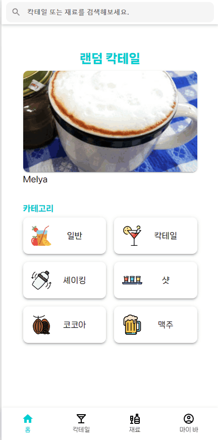
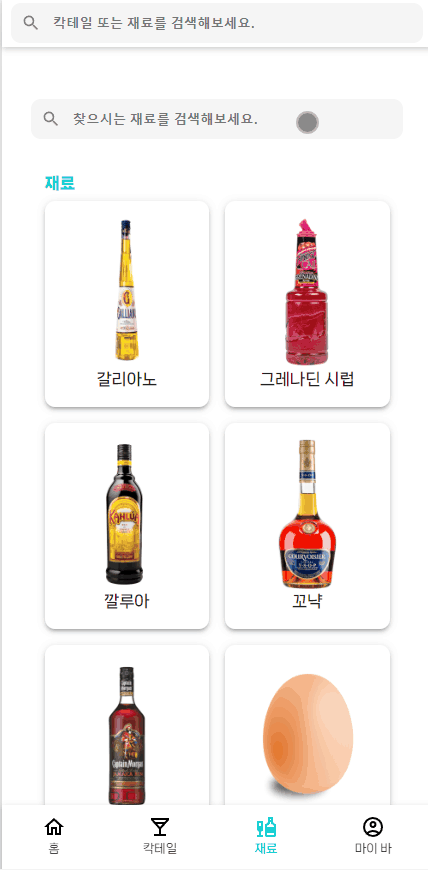

# 카악카악테일

<a href="https://cacaktail.netlify.app/" >카악카악테일 바로가기</a>

# 프로젝트 소개

이 사이트는 칵테일을 좋아하는 이들을 위한 칵테일 레시피와 정보를 제공하는 플랫폼입니다. 사용자들은 다양한 칵테일 레시피를 찾아보고, 칵테일 제조 방법을 얻을 수 있습니다.

## 스택

| **사용 기술** |      |
| --- | --- |
| **배포** |  |

## 커밋 컨벤션

```
- ADD : 새로운 기능 추가
- UPDATE : 업데이트 사항 추가
- FIX : 버그 수정
- DELETE : 기존 기능 삭제
```

# 페이지 소개

- ### 홈 페이지

  |**랜덤 칵테일**|**카테고리**|
  |---|---|
  |||

- ### 칵테일 페이지

  |**칵테일 카테고리**|
  |---|
  ||

- ### 재료 페이지

  |**재료 검색**|**재료 클릭**|
  |---|---|
  |||

- ### 마이 바 페이지

  <!-- |**재료 추가**|
  |---|
  || -->

# 핵심 기능 

## 무한 스크롤

> 적용 이유
 - 칵테일 리스트를 확인할 때 무한 스크롤을 적용해 자연스러운 스크롤 이벤트를 통한 사용자 경험을 높이고자 적용했습니다.

> 적용 방식
 - [react-intersection-observer](https://www.npmjs.com/package/react-intersection-observer) 를 사용해 구현했습니다.
 - 스크롤을 감지 할 태그에 `useInview()`훅의 `ref`를 넣고 사용자의 화면이 해당 태그를 감지 할 때를 확인합니다.
 - `useEffect()`를 통해 감지를 확인할 때마다 추가 데이터를 불러와 기존 칵테일 리스트에 추가합니다.
 - 만약 불러오는 데이터의 길이가 `10` 미만이면 무한 스크롤을 중지합니다.


<details>
<summary>코드</summary>

**FilteredCocktail.tsx**

```tsx
const FilteredCocktail = () => {
  // 스크롤을 감지할 ref
  const [ref, inView] = useInView()

  // 첫 로딩 -> 10개의 데이터를 불러옴
  useEffect(() => {
    if (selectedFilterValue !== pathFilterValue) {
      dispatch(
        getByFilter({
          filterValue: pathFilterValue,
          count: 0,
          reset: true,
          filter,
        }),
      )
    }
  }, [])

  // inView를 체크할 때마다 추가 데이터를 불러옴
  useEffect(() => {
    if (count !== 0 && !isEnd && inView) {
      dispatch(
        getByFilter({
          filterValue: pathFilterValue,
          count,
          reset: false,
          filter,
        }),
      )
    }
  }, [inView])

  return (
    drinkList && (
      <Container>
        ...

        {drinkList.map(drink => (
          <CocktailCard key={drink.idDrink} drink={drink} />
        ))}
        {isEnd && <HeadText text="끝" variant="h4" />}
      </Container>
    )
    <div ref={ref} />
  )
}
```
</details>