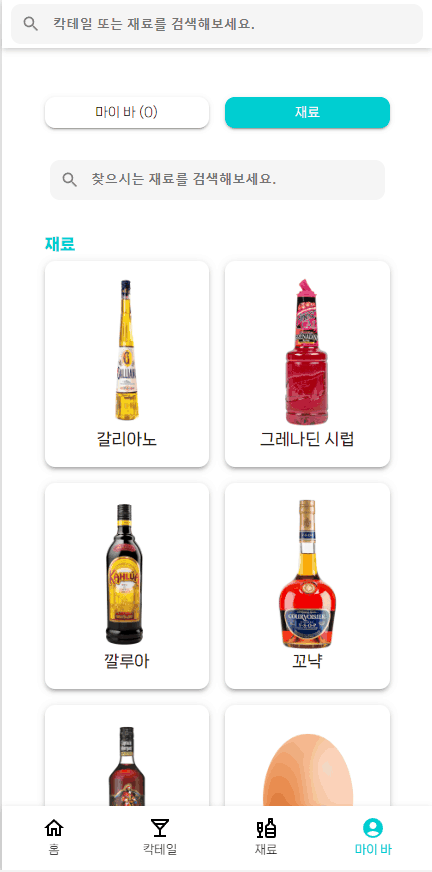

# 카악카악테일

<a href="https://cacaktail.netlify.app/" >카악카악테일 바로가기</a>

# 프로젝트 소개

이 사이트는 칵테일을 좋아하는 이들을 위한 칵테일 레시피와 정보를 제공하는 플랫폼입니다. 사용자들은 다양한 칵테일 레시피를 찾아보고, 칵테일 제조 방법을 얻을 수 있습니다.

## 스택

| **사용 기술** |      |
| --- | --- |
| **배포** |  |

## 커밋 컨벤션

```
- ADD : 새로운 기능 추가
- UPDATE : 수정 사항 추가
- FIX : 버그 수정
- DELETE : 기존 기능 삭제
```

# 페이지 소개

- ### 홈 페이지

  |**랜덤 칵테일**|**카테고리**|
  |---|---|
  |||

- ### 칵테일 페이지

  |**칵테일 카테고리**|
  |---|
  ||

- ### 재료 페이지

  |**재료 검색**|**재료 클릭**|
  |---|---|
  |||

- ### 마이 바 페이지

  |**재료 추가**|
  |---|
  ||